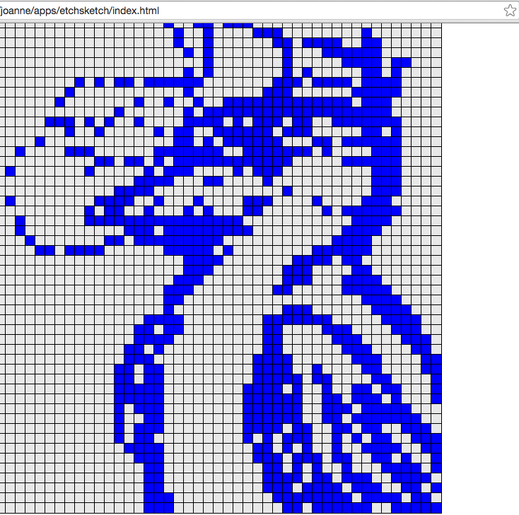

# etch-a-sketch
An Etch-A-Sketch with fun options

You can sketch with color or even choose an ombré option to give your drawings more depth!  
Simply start with the default grid or if you'd like to change the size, just add the grid size in the input field.
Then click any of the button options below it for your choice of styling.

Play here: http://nyjy85.github.io/etch-a-sketch/
 

Preview:

**Need Help with Styling**

I'm incapable of color coordination and design so if you'd like to contribute to the styling of this little app, it would be much appreciated!
